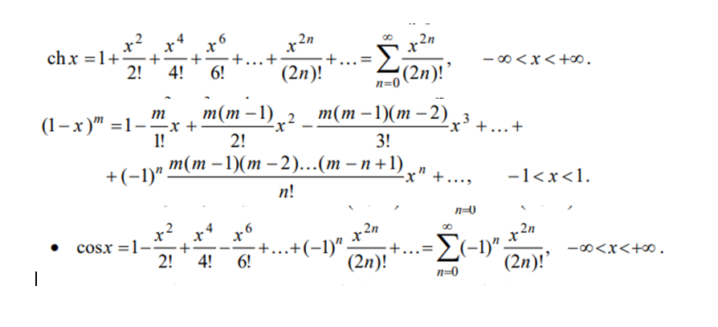

# My Project

## Описание

Этот проект реализует вычисление различных математических функций через ряды Тейлора.

## Функции

- `hyperbolic_cosine(x)` - вычисляет гиперболический косинус.
- `binomial_series(x, m)` - вычисляет биномиальный ряд.
- `cosine(x)` - вычисляет косинус.

## Пример использования

```python
from my_project import hyperbolic_cosine, binomial_series, cosine

print(hyperbolic_cosine(1))
print(binomial_series(0.5, 3))
print(cosine(3.14))
```
## Сcылки
https://github.com/

## Формулы

